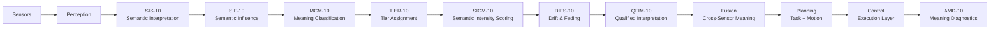

```mermaid
flowchart LR
    A["Sensors"] --> B["Perception"]
    B --> C["SIS‑10\nSemantic Interpretation"]
    C --> D["SIF‑10\nSemantic Influence"]
    D --> E["MCM‑10\nMeaning Classification"]
    E --> F["TIER‑10\nTier Assignment"]
    F --> G["SICM‑10\nSemantic Intensity Scoring"]
    G --> H["DIFS‑10\nDrift & Fading"]
    H --> I["QFIM‑10\nQualified Interpretation"]
    I --> J["Fusion\nCross‑Sensor Meaning"]
    J --> K["Planning\nTask + Motion"]
    K --> L["Control\nExecution Layer"]
    L --> M["AMD‑10\nMeaning Diagnostics"]
```
